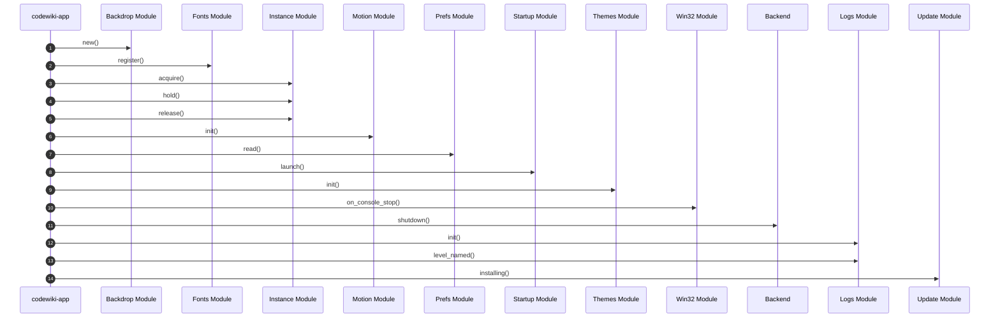

# codewiki-app Startup Flow

> Call sequence from the `main` entry point of `codewiki-app` across 12 parts of the codebase.

## Source

- `crates/codewiki-app/src/main.rs` — entry point

## How it works

```mermaid
sequenceDiagram
    autonumber
    participant p0 as codewiki-app
    participant p1 as Backdrop Module
    participant p2 as Fonts Module
    participant p3 as Instance Module
    participant p4 as Motion Module
    participant p5 as Prefs Module
    participant p6 as Startup Module
    participant p7 as Themes Module
    participant p8 as Win32 Module
    participant p9 as Backend
    participant p10 as Logs Module
    participant p11 as Update Module
    p0->>p1: new()
    p0->>p2: register()
    p0->>p3: acquire()
    p0->>p3: hold()
    p0->>p3: release()
    p0->>p4: init()
    p0->>p5: read()
    p0->>p6: launch()
    p0->>p7: init()
    p0->>p8: on_console_stop()
    p0->>p9: shutdown()
    p0->>p10: init()
    p0->>p10: level_named()
    p0->>p11: installing()
```

The sequence follows resolved calls outward from `main`, keeping only calls that cross from one documented part into another. Calls reached through trait objects or macros do not appear.

## Depends on

- [[codewiki-app]]
- [[Backdrop Module]]
- [[Fonts Module]]
- [[Instance Module]]
- [[Motion Module]]
- [[Prefs Module]]
- [[Startup Module]]
- [[Themes Module]]
- [[Win32 Module]]
- [[Backend]]
- [[Logs Module]]
- [[Update Module]]

## See also

- [[_index]]
- [[Crate Dependency Flow]]
